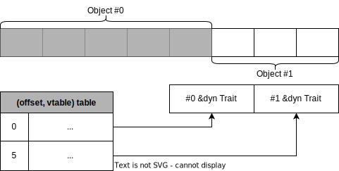

# UnsizedStack
Store unboxed DST objects

Provides efficient list when the elements don't need to get resorted for DST types.

## Diagram


## Example
Trait object
```rust
use unsized_stack::UnsizedStack;
use std::fmt::Debug;

let mut stack = UnsizedStack::<dyn Debug>::new();
stack.push("str", |item| item as _);
stack.push(1, |item| item as _);
stack.push(28342.2, |item| item as _);
dbg!(stack); // Print stack = ["str", 1, 28342.2]
```

str
```rust
use unsized_stack::UnsizedStack;
use std::fmt::Debug;

let mut stack = UnsizedStack::<str>::new();
stack.push("str", |item| item as _);
stack.push("asdf", |item| item as _);
stack.push("abcd", |item| item as _);
dbg!(stack); // Print stack = ["str", "asdf", "abcd"]
```

slices
```rust
use unsized_stack::UnsizedStack;
use std::fmt::Debug;

let mut stack = UnsizedStack::<[i32]>::new();
stack.push([1, 2], |item| item as _);
stack.push([3, 4], |item| item as _);
stack.push([5, 6], |item| item as _);
dbg!(stack); // Print stack = [[1, 2], [3, 4], [5, 6]]
```